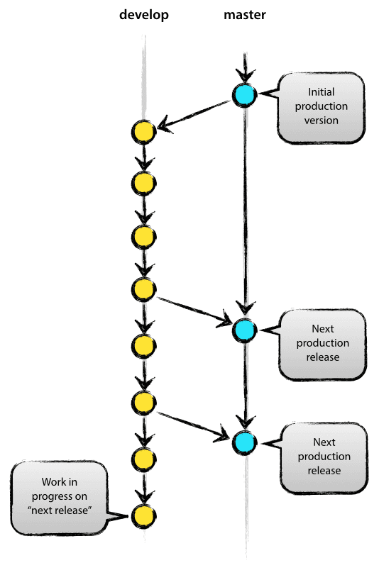

# Proposta de práticas de DevOps e Git branching.

<!-- ## Motivação

- Atualmente, eu e o Renan utilizamos o git e versionamos o firmware de maneira diferente: por exemplo, eu trabalho com `main`, `develop` e uma branch para cada feature novo; o Renan trabalha apenas com `main` e `develop`. Isso causa confusão ao trabalhar junto no mesmo projeto, pois cada um manipula as branches de uma maneira.
- Falta de controle sobre _releases_ e versões dos firmwares. Especialmente quando próximo de entrar em ambiente de produção, pode causar problemas.
- Com o aumento do número de pessoas desenvolvendo firmware, ficará mais difícil trabalhar em grupo caso não haja padrões bem definidos de DevOps e Git branching. -->

## Introdução

Padrões para uso de ferramentas de controle de versão são necessários para evitar frustrações e retrabalho durante o fluxo de desenvolvimento de uma aplicação e facilitar o trabalho em equipe. As principais etapas do processo de desenvolvimento de software &ndash; especificação, desenvolvimento, validação e evolução &ndash; são beneficiadas com o estabelecimento de padrões bem definidos para o controle de versão do software. Este documento trata-se de uma proposta simplificada de práticas para controle de versão, levando em consideração as particularidades do desenvolvimento de software para sistemas embarcados (firmware).

## Ferramentas

- Git: ferramenta grátis e de código aberto para controle de versões. [Faça download do Git a partir do site oficial aqui](https://git-scm.com/downloads).
- git-flow: conjunto de ferramentas para facilitar o trabalho com o [Gitflow](https://nvie.com/about/), modelo de ramificação de Git criado pelo engenheiro de software Vincent Driessen. A partir das últimas versões do Git, o git-flow já vem incluso. Para checar se você tem git-flow instalado, utilize o comando `git flow version`. Se o git-flow estiver instalado, você deverá ver a versão dele impressa no terminal:

  ```console
  $ git flow version
  1.12.3 (AVH Edition)
  ```

- [GitHub](https://github.com/): repositório Git em nuvem.

## Fluxo de trabalho

O fluxo de trabalho proposto é baseado no [Gitflow](https://nvie.com/about/), modelo de ramificação de Git criado pelo engenheiro de software Vincent Driessen.

O esquema de ramificação utilizado é descrito na seção [Esquema de ramificação](#esquema-de-ramificação).

Com o objetivo de tornar o material mais didático, a proposta será explicada através de um exemplo simplificado de desenvolvimento de um firmware.

### Versionamento semântico

Antes de começar o exemplo, é necessário falar sobre versionamento semântico &ndash; um conjunto de regras para definir as versões de um software.

A versão é definida por um conjunto de três números separados por pontos, por exemplo: `x.y.z`.

`x` define a versão maior (_major_) do software, associada a grandes mudanças no firmware. A mudança da versão maior pode implicar em incompatibilidade com funcionalidades de versões anteriores. Por exemplo, na versão 1.0.0 de um firmware, é possível receber dados do sensor de modelo A. Na versão 2.0.0, é retirado o suporte para o sensor A e adicionado suporte apenas para o sensor B.

`y` define a versão menor (_minor_) do software, associada a mudanças com retrocompatibilidade, ou seja, mudanças compatíveis com as funcionalidades de versões anteriores. Por exemplo, na versão 2.0.0 do firmware, é possível receber apenas informações de umidade e temperatura do sensor B. Na versão 2.1.0, é adicionada a funcionalidade de receber também informações de aceleração do mesmo sensor, de maneira que ainda é possível receber dados de umidade e temperatura.

`z` define a versão de correção (_patch_) do software, associada a correções de problemas no software. Por exemplo, na versão 2.1.0 do firmware, é identificado um problema relacionado ao tamnho de um _buffer_ que trava o código após receber determinado número de dados do sensor B. Na versão 2.1.1, o problema é corrigido aumentando o tamanho do _buffer_.

### Definição de versões e recursos

O primeiro passo é definir as primeiras versões do firmware, assim como seus recursos, associando-os a versões menores. Por exemplo:

| Versão | Descrição                                 |
| ------ | ----------------------------------------- |
| 0.1.0  | Acionamento de LED                        |
| 0.1.0  | Leitura de botão                          |
| 0.2.0  | Scan BLE                                  |
| 0.3.0  | Comunicação UART                          |
| 1.0.0  | Teste de firmware em ambiente de produção |

### Preparação incial do ambiente de desenvolvimento

Agora é o momento de preparar o ambiente de desenvolvimento. O passo a passo é o seguinte:

1. Criar repositório no GitHub.
2. Clonar repositório localmente utilizando `git clone`.
3. Utilizar o comando `git flow init` para configurar o git-flow. Neste momento, serão requisitados nomes e prefixos para os nomes dos ramos do projeto. A seguinte configuração é utilizada:

   ```console
   $ git flow init
   No branches exist yet. Base branches must be created now.
   Branch name for production releases: [master] main
   Branch name for "next release" development: [develop]

   How to name your supporting branch prefixes?
   Feature branches? [feature/] recurso/
   Bugfix branches? [bugfix/]
   Release branches? [release/] lancamento/
   Hotfix branches? [hotfix/] hotfix/
   Support branches? [support/]
   Version tag prefix? [] v
   Hooks and filters directory? [C:/Users/Henrique/isensi/shiny-waffle/.git/hooks]
   ```

   Aqui, o ramo para lançamentos de produção foi nomeado de `main` e o ramo para os próximos lançamentos foi nomeado de `develop`. Os prefixos dos ramos de recurso (_feature_), lançamento (_release_) e _hotfix_ foram definidos, respectivamente, como `recurso/`, `lancamento/` e `hotfix/`. Visando simplificar as operações, os ramos de _bugfix_ _support_ não serão utilizados. O prefixo para as _tags_ das versões foi definido como a letra `v`.

4. Assegure-se de que você está no ramo `develop` (se não estiver, use o comando `git switch develop` para trocar para o ramo correto) e então deve-se subir as mudanças para o GitHub utilizando o comando `git push --set-upstream origin develop`.

### Desenvolvimento de recursos

Para desenvolvimento de recursos, são criados ramos de recursos, utilizando o comando `git flow feature start nome-do-recurso`. Este comando cria um novo ramo a partir do `develop`. Por questões de padronização, os nomes dos recursos devem ser em letras minúsculas e separados por traços.

Antes de criar um novo ramo para o recurso, no ramo `develop`, utiliza-se o comando `git pull` para se assegurar de que o novo recurso será adicionado sobre a última versão disponível do `develop`:

```console
$ git checkout develop # caso não esteja no develop
$ git pull
```

Ao inserir o comando `git pull`, pode haver conflitos por conta de outras pessoas trabalhando no mesmo projeto. Se for o caso, resolva-os e continue para os próximos passos. Isso vale pra todas as vezes que o comando `git pull` for utilizado.

Cria-se, então, o ramo referente ao primeiro recurso, e sobe-se o novo ramo para o GitHub:

```console
$ git flow feature start acionamento-led
$ git push --set-upstream origin recurso/acionamento-led
```

A partir deste ponto, trabalha-se normalmente no novo recurso, realizando os _commits_ e subindo as alterações para o GitHub utilizando `git push`.

Quando o recurso estiver pronto, deve-se incorporar ao `develop` e subir as mudanças para o GitHub:

```console
$ git flow feature finish acionamento-led
$ git push
```

O comando `git flow feature finish` incorpora o ramo de recurso ao `develop`, muda para o `develop` e remove o ramo de recurso.

Ao inserir o comando `git push`, é possível que haja erros (`error: failed to push some refs to ...`) por conta de conflitos resultantes de outras pessoas trabalhando no mesmo projeto. Se for o caso, utilize o comando `git pull` primeiro, resolva os conflitos, e insira o comando `git push` novamente. Isso vale para todos os casos em que houver conflitos ao utilizar o comando `git push`.

Correções de problemas que não foram encontrados em estado de lançamento devem ser tratadas como recursos, visando simplificar as operações.

### Criação de lançamentos

Quando todos os recursos associados à versão 0.1.0 estiverem prontos, cria-se o lançamento relativo a esta versão. Antes, entretanto, utiliza-se o comando `git pull` no `develop` para criar o lançamento a partir da última versão do develop.

```console
$ git checkout develop # caso não esteja do develop
$ git pull
$ git flow release start 0.1.0
```

O comando `git flow release start` cria um ramo de lançamento a partir do `develop`.

Aqui, corrige-se as versões escritas no código. Por exemplo, suponha que havia o seguinte _header_ em um dos arquivos:

```c
/**
 * @file main.c
 * @author Henrique
 * @brief
 * @version 0.0.0
 * @date 2023-05-04
 *
 * @copyright Copyright (c) 2023
 *
 */
```

O _header_, então, é alterado para:

```c
/**
 * @file main.c
 * @author Henrique
 * @brief
 * @version 0.1.0
 * @date 2023-05-04
 *
 * @copyright Copyright (c) 2023
 *
 */
```

Para finalizar o lançamento, deve-se realizar o _commit_, inserir o comando `git flow release finish` e subir as mudanças para o github:

```console
$ git commit -m "troca de versão"
$ git flow release finish 0.1.0 -m "mensagem para tag"
$ git push
```

O comando `git flow release finish` incorpora as mudanças ao `main` e ao `develop` e cria uma _tag_ a partir do `main`.

Sempre que um lançamento for criado, é necessário também subir as mudanças no `main` e a _tag_ criada:

```console
$ git checkout main
$ git push --set-upstream origin main
$ git push v0.1.0
```

O argumento `--set-upstream origin main` só é necessário caso seja a primeira vez subindo o `main`.

Por último, no GitHub, cria-se um lançamento, segundo descrito na seção [Criando lançamentos no GitHub](#criando-lançamentos-no-github).

### Correção de problemas em produção

Quando um problema é encontrado em um dos lançamentos, é criado um ramo de _hotfix_, que depois é incorporado de volta ao `main` e ao `develop`. Supondo que após o lançamento da versão 0.1.0 seja encontrado um problema que deve ser resolvido com urgência, cria-se o ramo de _hotfix_ utilizando o comando `git flow hotfix start 0.1.1`. Antes, entretanto, utiliza-se o comando `git pull` no ramo `main` para efetuar as correções a partir da última versão do `main`.

```console
$ git checkout main # caso não esteja no main
$ git pull
$ git flow hotfix start 0.1.1
```

O comando `git flow hotfix start 0.1.1` cria um ramo de _hotfix_ a partir do `main`.

Quando o problema for resolvido, realiza-se o _commit_ das mudanças, finaliza-se a correção do problema e sobe-se todas as mudanças para o GitHub:

```console
$ git commit -m "solução do problema encontrado"
$ git flow hotfix finish 0.1.1 -m "mensagem para tag"
$ git push
$ git checkout main
$ git push
$ git push v0.1.1
```

O comando `git flow hotfix finish` incorpora o ramo de _hotfix_ ao `main` e ao `develop` e cria uma _tag_ a partir do `main`.

Qualquer conflito que ocorrer nesta etapa deve ser resolvido para continuar as operações normalmente logo em seguida.

<!-- ## Dicionário de termos

- _release_: lançamento.
- _feature_: recurso.

### Dicionário de Git

- `git clone <url-ou-uri-do-repositorio>`: clona repositório remoto com URL/URI \<url-ou-uri-do-repositorio\>.
- `git checkout <nome-branch>`: muda para branch com nome \<nome-branch\>.
- `git checkout -b <nova-branch>`: cria branch com nome \<nova-branch\> a partir da branch atual.
- `git add .`: adiciona todas as mudanças ao próximo _commit_.
- `git commit -m "exemplo"`: cria _commit_ com mensagem "exemplo".
- `git merge --no-ff <nome-branch>`: incorpora branch com nome \<nome-branch\> à branch atual, sem _fast forward_.
- `git push <nome-remoto> <nome-branch>`: sobe mudanças na branch com nome \<nome-branch\> ao remoto com nome \<nome-remoto\>.
- `git tag -a <x.y.z> -m "exemplo"`: cria _tag_ \<x.y.z\> a partir da branch atual, com mensagem "exemplo".
- `git branch -d <nome-branch>`: deleta branch com nome \<nome-branch\>.

## Motivação

- Atualmente, eu e o Renan utilizamos o git e versionamos o firmware de maneira diferente: por exemplo, eu trabalho com `main`, `develop` e uma branch para cada feature novo; o Renan trabalha apenas com `main` e `develop`. Isso causa confusão ao trabalhar junto no mesmo projeto, pois cada um manipula as branches de uma maneira.
- Falta de controle sobre _releases_ e versões dos firmwares. Especialmente quando próximo de entrar em ambiente de produção, pode causar problemas.
- Com o aumento do número de pessoas desenvolvendo firmware, ficará mais difícil trabalhar em grupo caso não haja padrões bem definidos de DevOps e Git branching. -->

## Esquema de ramificação

A proposta é fazer o mais simples possível, levando em consideração que o desenvolvimento de firmware é diferente de outros tipos de software, já que o firmware pode depender do hardware e do ambiente de produção.

A figura abaixo mostra o modelo de Git branching sugerido. Ao longo desta seção, o ramo `master` será chamado de `main` pois é o nome que o time já está acostumado a utilizar.


### Ramos principais

Os dois principais ramos são `main` e `develop`. Ambos possuem um tempo de vida infinito, ou seja, nunca são deletados.

- `main`: Possui apenas estados do firmware prontos para produção. **Importante:** toda vez que um ramo for incorporado ao `main`, deve-se criar um _release_ no GitHub, com o hexadecimal ou binário do firmware, conforme descrito na seção [Criando lançamentos no GitHub](#criando-lançamentos-no-github). Assim, um desenvolvedor não depende do outro nem das ferramentas deste para gravar o firmware desejado.
- `develop`: Possui apenas estados do firmware com as últimas mudanças para o próximo lançamento.

A figura abaixo ilustra a utilização dos ramos `main` e `develop`.



### Ramos de suporte

Os ramos de suporte são os ramos de recurso, lançamento e _hotfix_. Estes ramos auxiliam no desenvolvimento paralelo entre diversos membros da equipe, rastreamento fácil de recursos, e arrumar rapidamente problemas encontrados em produção.

#### Ramos de recurso

Ramos de recurso são originados do ramo `develop` e são incorporadas de volta ao mesmo.

Ramos de recurso utilizados para o desenvolvimento de novos recursos para o próximo lançamento ou um lançamento futuro. Idealmente, cada recurso deve ter um lançamento alvo.

Quando incorporados de volta ao `develop`, são deletados. Caso algo aconteça e for decidido que o recurso será descartado, basta deletar o ramo sem incorporá-lo de volta ao `develop`.

<!-- Exemplo de uso de uma branch de _feature_:

```console
$ git checkout develop # muda para branch develop
$ git checkout -b novo-feature develop # cria branch novo-feature a partir da develop

desenvolvimento completo do feature...

$ git add . # adiciona todas mudanças ao commit
$ git commit -m "desenvolvimento de novo feature" # faz commit das mudanças
$ git checkout develop # volta à develop
$ git merge --no-ff novo-feature # incorpora novo-feature à develop
$ git push origin develop # sobre mudanças na develop para repositório remoto
$ git branch -d novo-feature # deleta branch novo-feature
```

A flag `--no-ff` faz com que um novo _commit_ seja criado ao incorporar a nova branche, mantendo um histórico mais claro de commits. A figura abaixo ilustra a diferença entre uma incorporação utilizando a flag `--no-ff` (à esquerda) e uma com _fast forward_ (à direita). -->

#### Ramos de lançamento

Ramos de lançamento são originadas do ramo `develop` e incorporados ao `develop` e ao `main`. Ramos de lançamento são criados apenas para corrigir a versão antes de incorporar o código ao `main`.

<!-- A convenção de nomenclatura é `release-*`, em que `*` é a versão do `release`, de três números separados por um ponto (_e.g._, 1.2.0). -->

<!-- Ramos de lançamento guardam os códigos de preparação para determinado lançamento, permitindo correção de bugs menores e da versão do firmware. Desta forma, o ramo `develop` também pode continuar recebendo novos recursos para o próximo lançamento.

O momento correto de criar um ramo de lançamento é quando todos os recursos do lançamento já tiverem sido incorporados ao `develop`, por isso a importância de saber o lançamento alvo de cada recurso. É neste momento que a versão do firmware deve ser definida e as alterações associadas à versão devem ser realizadas.

Quando o estado do ramo estiver realmente pronto para um lançamento, ela deve ser incorporada às branches `main` e `develop`. Ao incorporar à branch `main`, deve-se criar uma _tag_ para futura referência a esta versão e criar um lançamento no GitHub, conforme descrito [aqui](#criando-releases-no-github). -->

<!-- Exemplo de uso de uma branch de _release_:

```console
$ git checkout develop
$ git checkout -b release-1.2.0 develop release-1.2.0 a partir da develop

preparação para o release...

$ git add .
$ git commit -m "preparação para release 1.2.0 finalizada"
$ git checkout main
$ git merge --no-ff release-1.2.0
$ git tag -a 1.2.0 -m "comentário sobre o release" # cria tag com base no estado atual do main
$ git push origin main
$ git checkout develop
$ git merge --no-ff release-1.2.0
$ git push origin develop
$ git push origin 1.2.0
$ git branch -d release-1.2.0
```

Se houver conflitos ao tentar incorporar à branch `develop`, o que é provável já que o número da versão foi alterado, deve-se resolver os conflitos e continuar a incorporação. -->

#### Ramos de _hotfix_

Ramos de _hotfix_ são originados da `main` e são incorporados de volta ao `develop` e ao `main`.

<!-- A convenção utilizada para nomear as branches de _hotfix_ é `hotfix-*`, em que `*` é o número relativo à _hotfix_, que é associado ao número da _release_ (_e.g_, se a versão da _release_ é 1.2 e for o primeiro _hotfix_, o nome da branche fica `hotfix-1.2.1`). -->

Ramos de _hotfix_ não são planejados e são criados quando surge um problema numa versão já em produção que deve ser resolvido com urgência. Ao criar o ramo de _hotfix_, a versão do firmware no código deve ser editada e, quando o problema for resolvido, o ramo deve ser incorporado ao `main` e ao `develop`. Quando incorporado ao `main`, deve-se criar uma _tag_ e criar um lançamento no GitHub.


<!-- Exemplo de uso de branches de _hotfix_:

```console
$ git checkout -b hotfix-1.2.1 main

resolução do problema...

$ git commit -m "Fixed severe production problem"
$ git checkout main
$ git merge --no-ff hotfix-1.2.1
$ git tag -a 1.2.1 -m "comentário sobre o hotfix"
$ git push origin main
$ git checkout develop
$ git merge --no-ff hotfix-1.2.1
$ git push origin develop
$ git push origin 1.2.1
$ git branch -d hotfix-1.2.1
``` -->

## Criando lançamentos no GitHub

[Lançamentos, ou _releases_ do GitHub](https://docs.github.com/en/repositories/releasing-projects-on-github/managing-releases-in-a-repository) são utilizados para juntar em uma página só, códigos de determinada versão de uma aplicação com notas de lançamento, menções a contribuidores e outros arquivos associados. Esta é uma ferramenta útil pois permite a criação de uma página para cada versão de firmware com notas sobre a versão e, principalmente, arquivos binários ou hexadecimais do firmware, sem que haja necessidade de voltar a determinada versão e compilar novamente quando se deseja verificar ou testar algo. Por mais que não seja tão trabalhoso, pode haver problemas com a versão do SDK caso esta seja alterada, _overlays_ de placa, além da compilação depender de caminhos e configurações específicas dentro de determinados arquivos do projeto (por exemplo, os arquivos na pasta `.vscode/`, no caso de se utilizar as extensões para o VS Code dos SDKs da Nordic e da Espressif para compilar os projetos).

[Este link](https://docs.github.com/en/repositories/releasing-projects-on-github/managing-releases-in-a-repository#creating-a-release) ensina a criar _releases_ no GitHub e é só seguir o passo a passo e, com atenção aos seguintes pontos:

- No passo 1, utilizar um título no padrão `apelidodofirmware v[x.y.z]` (_e.g_, `xavierb v1.2.0`).
- No passo 4, usar uma _tag_ existente, que já deve ter sido subida para o GitHub.
- No passo 8, citar versão dos outros firmwares dependentes do que se está criando o _release_ (por exemplo, no caso do XavierB, citar versão do XavierL e XavierW).
- No passo 9, incluir os arquivos binários/hexadecimais do firmware, seguindo o padrão `apelidodofirmware_hardwarealvo_v[x.y.z].[bin|hex]`. Por exemplo, no caso do arquivo hexadecimal do XavierB, compilado para a placa LEW840F-M2-V3 da Fanstel, na versão 1.2.0, o arquivo fica `xavierb_lew840fm2v3_v1.2.0.hex`, tudo em minúsculo e sem traços. De preferência, deve-se incluir os arquivos binários/hexadecimais para todos os hardwares no qual foi testado, incluindo o nRF52840DK, por exemplo.

## Perguntas relevantes

### E o Jira?

Nada muda no Jira. Esta proposta se trata apenas de como as operações com Git são feitas.

### Estamos no meio do desenvolvimento, o que fazer neste caso?

Sugestão: começar a implementar as práticas descritas neste documento a partir da primeira versão que for para teste em ambiente de produção, que será a versão 1.0.0. A partir desse momento, planejar os próximos recursos e versões e começar a implementar as mudanças.

## Referências

- [How To Use Git-Flow In Embedded Software Development](https://medium.com/jumperiot/how-to-use-git-flow-in-embedded-software-development-dbb2a78da413)
- [A successful Git branching model](https://nvie.com/posts/a-successful-git-branching-model/)
- [Git: diferenças entre fast forward e three way](https://www.lumis.com.br/a-lumis/blog/git.htm)
- [Git: Basic Branching and Merging](https://git-scm.com/book/en/v2/Git-Branching-Basic-Branching-and-Merging)
- [What Is a Git Merge Fast Forward?](https://blog.mergify.com/what-is-a-git-merge-fast-forward/)
- [Git Basics - Tagging](https://git-scm.com/book/en/v2/Git-Basics-Tagging)
- [Semantic Versioning 2.0.0](https://semver.org/)
- [Fluxo de trabalho de Gitflow](https://www.atlassian.com/br/git/tutorials/comparing-workflows/gitflow-workflow)
